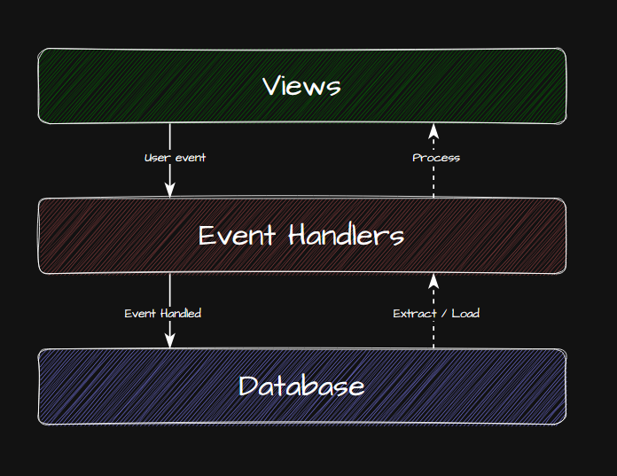
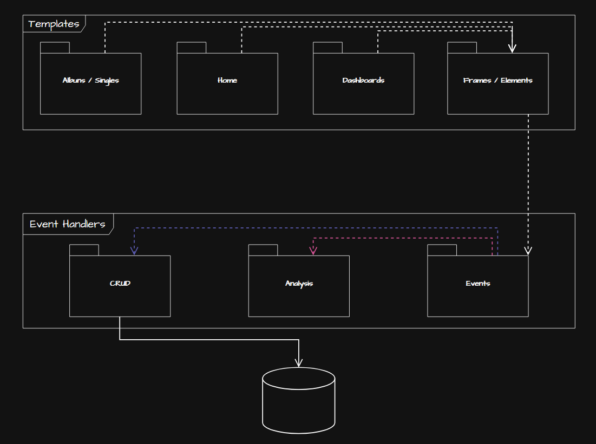
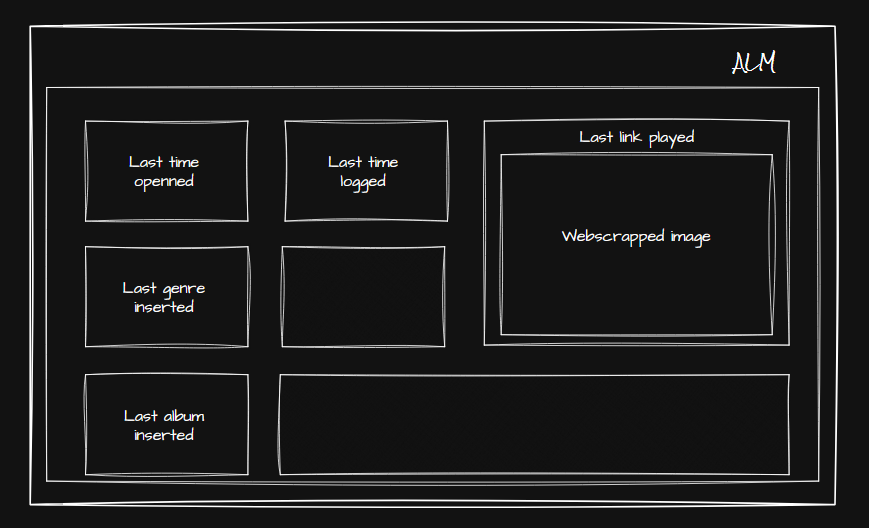
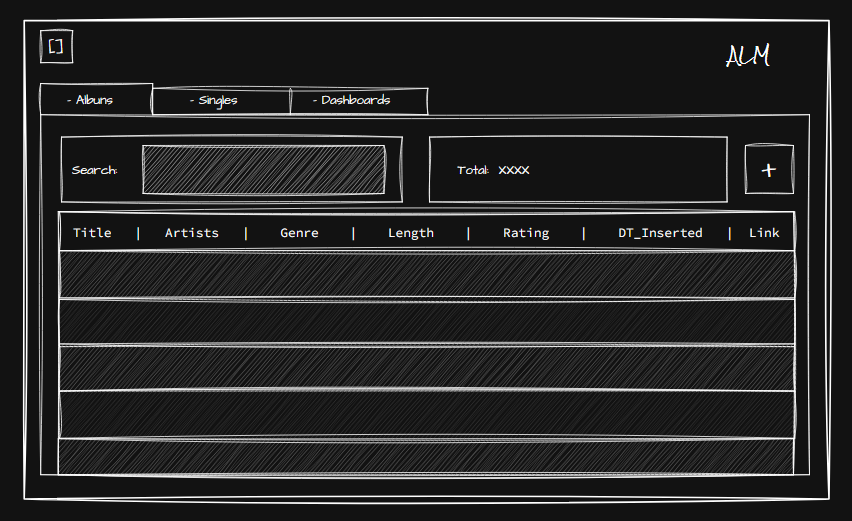
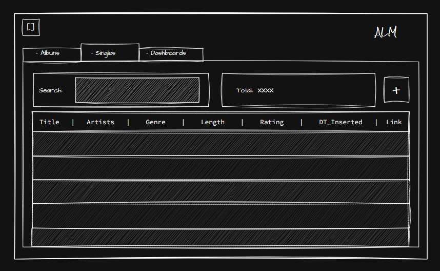
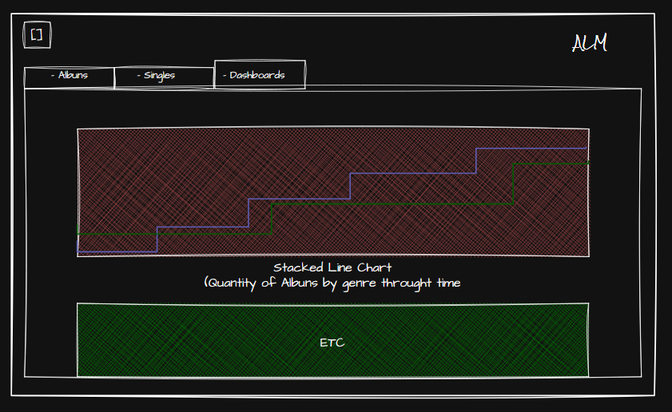
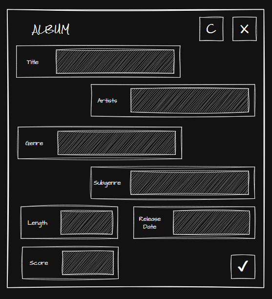

# TL-DR:

Just a project to organize and analyse collections of musical albums

# Introduction

## A little bit of storytelling. Or what are my excuses? (Justification)

This project started with a spreadsheet so that I could search them when youtube would
delete an album in the good old days of VEVO channels. This started when I watched 
Samurai Champloo and discovered Nujabes, Tsuchie, Bugseed, J. Dilla, and then the youtube
musical rabbithole started. Until then I was a musical elitist, even though I was listining
to pretty much "average" stuff that 13 year old at 2009 wanna be elitist would listen
(metal, classical and barroque, and rap).

From that moment on I started to catalog the albums, at the time i didn't have any idea 
about what was software engineering, data bases, sql, and so on, so the data was not 
properly strutured. The initial purpose would be just to log the albums that I found 
interesting. I tried to do some data analysis with excel, but at the time it was frustrating,
I did not have any idea of data analysis and making charts in excel isn't that fun.
I simply gave up in making analysis over this collection conforming with just logging
albums.

Then I got in college, got a bachelor degree in Chemistry, found out that the career
is very monotonous and decided to change career, got into software engineering and started
a new technologist degree in analysis and development of systems. And then, this project
became very viable, until then, for me, computers were magical.

## What's about (Description)

So, the project consists of analysing a collection of musical albums, visualizing this
through charts and graphs. 

My intent is to use only python and native packages, there is no need to use much more,
to create a graphical user interface, the graphs and charts, api to query into a DB.
I'll use sqlite3 for the DB, because there is no need to overthink about types, security,
distribution, etc., sqlite3 is more than enough. The graphical user interface will be 
developed with tkinter and I'll try to make look decent, the graphs and charts will be
developed with tkinter too, maybe I'm insane, but I'll try nevertheless, there is the 
canvas class in the tkinter. Why not do something with it?

The lesser dependencies, the better.

## What do I expect to achieve (Objectives)

    1. Life improvements to the way the I log albums;
    2. Have some insights about my musical journey from 2014ish to nowadays (diversification of genres, e.g.);
    3. Do some software engineering stuff;
    4. Have a initial understanding of image renderization with graphs and charts;

## How it will be made (Methodology)

Having a job, attending to classes and their assignments, etc., the methodology need 
to take in account this situation, so, there is no logic in forcing some cookie-cutter  
edge new, hyped methodology.

The project will be structured around 4 general activities:

    1. Analysis: activities related with defining the project, what need to be done, etc. (definition);
    2. Design: activities related with modeling the project, how it will look like, sketch, etc. (modelation);
    3. Development: activities related with getting the project out of paper (construction);
    4. Refactoring: activities related with improvements of what's already built (iteration);

The porpose to classify in this manner is so that priorities are set, first define what 
need to be done, model what looks like and then construct it, and if necessary improve
or repair it. Within this perspective is somewhat like waterfall.

Each general activity has specifics activities, such as solving some bug, document something.
Also, these activities have different degree of difficult, that will be classified as:

    - Blurry (embaçado) (16): something that isn't impossible, but it's quite hard;
    - Annoying (chatao) (8): something that isn't that trivial and takes some time;
    - Burdensome (tramposo) (4): not hard, just take some time;
    - Tranquil (tranquilo) (2): should not take alot o time and is relatively doable;
    - Smooth (dibas) (1): some activity that is very doable in a small amount of time;

So, the methodology here proposed aims to achieve a certain score per month, at least
8 points, averaging to a tranquil activity per week. I think it's very doable, but 
we'll see. As every other project the activities evolve with it.

I'll try to document my experience through the project too, so if something interesting
grabs my attention within the project or if difficults are encountered through the project
I'll log it here monthly. 

Someking of report of what was done in that month.

The activities will be organized in a TODO list here. I could do it in some kanban style,
in the end is the same thing. The justification for the list is to put everything in 
the same place. The project isn't that large and there is no need to divide temporally
(backlog, doing, done, redo, etc.) because it's just me here so the activities aren't 
concurrent or parallel.

# Requirements

## Functional requirements

### CRUD

    - Singles;
    - Albums;

### Charts

    - Average score by year of insertion (bar chart);
    - Average score by year of release date (bar chart);
    - Frequency of genres (histogram);
    - Frequency of subgenre (histogram);
    - Diversification of genres by years (tree chart);
    - Diversification of subgenres by years (tree chart);
    - Relative frequency of genres by year (stacked area chart)
    - Relative frequency of subgenres by year (stacked area chart)
    - Quantity of albums per release year (line chart)
    - Number of insertions by year (line chart)

    - Uncertain
    - Frequency of predominant BPM

### Track

    - Last album inserted;
    - Last single inserted;
    - Last time opened
    - Last album redirected
    - Number of time redirected from an album
    - 

## System requirements

    - 
    

# System Design

## General structure

## General Behavior

## DB structure

## UI wireframe

